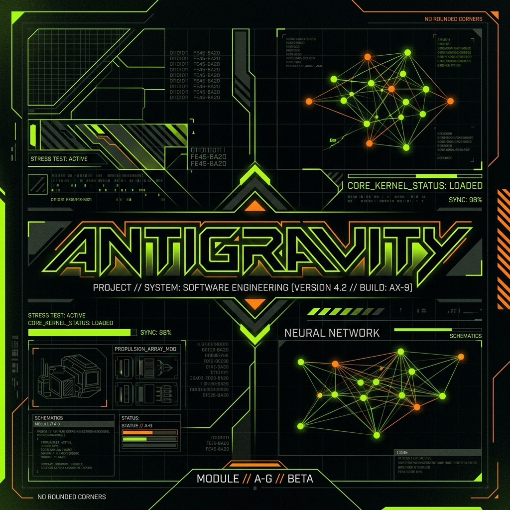
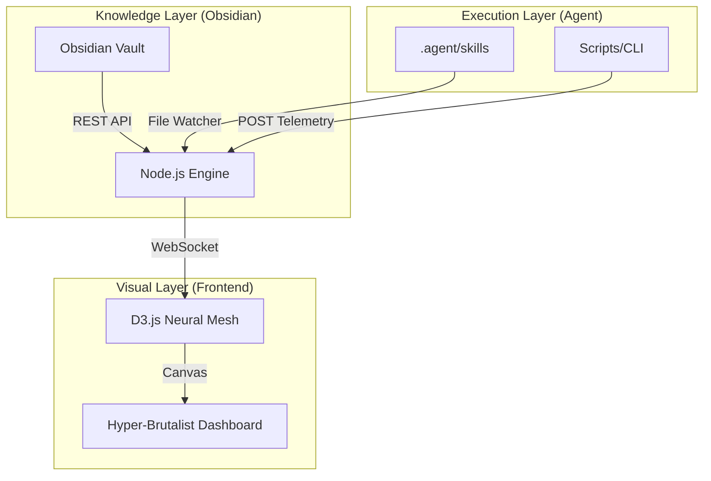

# ⚡ ANTIGRAVITY ECOSYSTEM



> **HYPER-BRUTALIST ENGINEERING DASHBOARD**
> *Status: Operational | Version: 2.0.25 | Design Protocol: Brutalist-Alpha*

---

## 🛰️ Visão Geral

O **Antigravity Ecosystem** é o sistema nervoso central de uma infraestrutura de desenvolvimento orientada a agentes. Projetado para oferecer visibilidade total sobre processos cognitivos artificiais, o ecossistema mapeia, em tempo real, a ativação de skills, o fluxo de conhecimento do **Obsidian** e a telemetria de execução.

### 📼 Demonstração em Tempo Real

<div align="center">
  <video src="ecosystem/teste1111.mp4" width="100%" controls></video>
  <p><i>Visualização da malha neural processando sinais de ativação e sincronização de conhecimento.</i></p>
</div>

---

## 🔳 Core Philosophy: Hyper-Brutalist Engineering

Diferente de dashboards convencionais, o Antigravity adota a estética **Hyper-Brutalist**:
- **Geometria Zero-Radius:** Sem bordas arredondadas. Apenas ângulos retos e precisão técnica.
- **Paleta de Alta Visibilidade:** Uso estrito de **Acid Green (#00ff7f)** e **Signal Orange (#ff6d00)**.
- **Purple Ban:** Proibição total de tons violetas para manter o foco na instrumentação de engenharia.
- **Performance de Baixa Latência:** Renderização via Canvas D3.js para processar centenas de eventos por segundo a 60fps.

---

## 🧠 Características Principais

### 1. Neural Skill Mapping
Mapeamento dinâmico de todas as capacidades do agente. Cada skill no diretório `.agent/skills` é representada como um nó persistente que pulsa ao ser ativado.

### 2. Obsidian Brain-Sync
Integração profunda com o **Obsidian Vault**. O dashboard visualiza pulsos toda vez que o agente acessa ou modifica o seu grafo de conhecimento, criando uma ponte visual entre o "pensamento" (notas) e a "ação" (código).

### 3. Real-time Telemetry HUD
Um console de logs de alta fidelidade que transmite eventos via WebSockets, permitindo o monitoramento granular de erros, sucessos e alertas de segurança sem a necessidade de recarregar a página.

---

## 🏗️ Arquitetura do Sistema

O ecossistema opera em uma malha reativa de baixa latência:



---

## 🚀 Instalação & Setup

### Pré-requisitos
- **Node.js v20+**
- **Git**
- **Obsidian** com o plugin **Local REST API** configurado e ativo.

### Guia de Início Rápido

1. **Clone e Instale:**
   ```bash
   git clone https://github.com/KaueBR12/Antigravity-Ecosystem.git
   cd Antigravity-Ecosystem/ecosystem
   npm install
   ```

2. **Configuração do Ambiente:**
   Certifique-se de que o diretório `.agent` está na raiz do seu workspace para que o *Watcher* possa detectar as skills automaticamente.

3. **Inicie o Servidor:**
   ```bash
   node server.js
   ```

4. **Acesse a Interface:**
   Navegue para `http://localhost:4091`. Para a experiência de "Mission Control", use o modo Fullscreen (**F11**).

---

## 📟 Protocolos de API

O ecossistema pode ser alimentado externamente via HTTP para integração com ferramentas de CI/CD ou outros scripts:

### Trigger de Ativação
```bash
curl -X POST http://localhost:4091/api/activate \
     -H "Content-Type: application/json" \
     -d '{"skill": "security-scan", "status": "active"}'
```

### Injeção de Log no HUD
```bash
curl -X POST http://localhost:4091/api/log \
     -H "Content-Type: application/json" \
     -d '{"message": "Deploy protocol initiated", "level": "info"}'
```

---

## 🛠️ Stack Tecnológica
- **Backend:** Node.js, Express, WebSockets (ws), Chokidar.
- **Frontend:** Vanilla JS, D3.js, Canvas API, CSS Grid.
- **Orquestração:** Antigravity AI Agent.

---

## 🛡️ Licença & Créditos
Desenvolvido por **KaueBR12** em colaboração com o ecossistema **Antigravity AI**.
*Engineering software for the next generation of autonomous agents.*

---

> [!IMPORTANT]
> **COMPLIANCE NOTICE**: Este repositório é uma peça de instrumentação avançada. Modificações na estética devem respeitar o manual de design brutalista.
