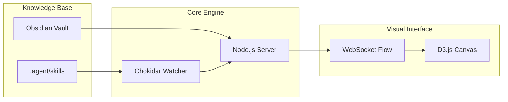

# ⚡ ANTIGRAVITY ECOSYSTEM

> **HYPER-BRUTALIST ENGINEERING DASHBOARD**
>
> *Real-time Cognitive Mapping & Neural Skill Orchestration*

<div align="center">
  <video src="ecosystem/teste1111.mp4" width="100%" controls></video>
  <p><a href="https://github.com/KaueBR12/Antigravity-Ecosystem/blob/main/ecosystem/teste1111.mp4">Clique aqui para ver o vídeo de demonstração</a></p>
</div>

---

## 🛰️ Visão Geral

O **Antigravity Ecosystem** não é apenas um dashboard; é o **sistema nervoso central** da sua infraestrutura de desenvolvimento. Ele visualiza a atividade do agente em tempo real, monitorando a ativação de skills, logs de sistema e interações com o conhecimento armazenado.

### 🔳 Core Philosophy: Hyper-Brutalist Engineering
Abandonamos os clichês de design "soft" e cores genéricas. O ecossistema utiliza:
- **Acid Green (#00ff7f)** & **Signal Orange (#ff6d00)** para máxima legibilidade técnica.
- **Geometria Zero-Radius:** Bordas afiadas e grids sólidos para um visual de engenharia pura.
- **Performance-First:** Renderização via Canvas D3 para garantir 60fps mesmo com centenas de nós ativos.

---

## 🧠 A Ponte de Conhecimento (Obsidian + Skills)

Este projeto foi desenhado para ser o espelho visual do seu **Obsidian Vault** e do seu diretório de **Skills**.

### 1. Integração Obsidian
O ecossistema monitora constantemente o seu segundo cérebro. Quando você consulta ou edita notas no Obsidian relacionadas ao projeto, o dashboard emite um **Pulso Neural**, visualizando a conexão entre o pensamento (nota) e a ação (código).

### 2. Agent Skills Orchestration
Cada skill disponível no seu diretório `.agent/skills` é mapeada como um nó na rede.
- **Verde Ácido:** Skills em standby.
- **Laranja Ativo:** Skills em execução.
- **Pulsos:** Fluxo de dados e logs em tempo real.

---

## 🏗️ Arquitetura Técnica

O sistema opera em uma malha reativa de baixa latência:



---

## 🚀 Instalação & Setup

### Pré-requisitos
- **Node.js v18+**
- **Obsidian** (com o plugin REST API ativado para integração total)
- **Antigravity Agent** configurado.

### Configuração Rápida

1. **Clone o repositório:**
   ```bash
   git clone https://github.com/KaueBR12/Antigravity-Ecosystem.git
   cd Antigravity-Ecosystem/ecosystem
   ```

2. **Instale as dependências:**
   ```bash
   npm install
   ```

3. **Inicie o Sistema Nervoso:**
   ```bash
   node server.js
   ```

4. **Acesse a Interface:**
   Abra o seu navegador em `http://localhost:4091` e entre em modo Fullscreen (F11) para a experiência completa.

---

## 📟 Protocolos de Uso

### Ativação via CLI
Você pode disparar pulsos manualmente para testar integrações:
```bash
curl -X POST http://localhost:4091/api/activate \
     -H "Content-Type: application/json" \
     -d '{"skill": "brainstorm", "isObsidian": true}'
```

---

## 🛠️ Desenvolvido por
**KaueBR12** & **Antigravity AI**
*Engenharia de software de alta performance e design técnico avançado.*

---

> [!CAUTION]
> **PURPLE BAN ENFORCED:** Este projeto segue a diretriz de design restrita: proibido o uso de tons violetas ou purpúreos. A paleta é estritamente Engineering-Grade.
