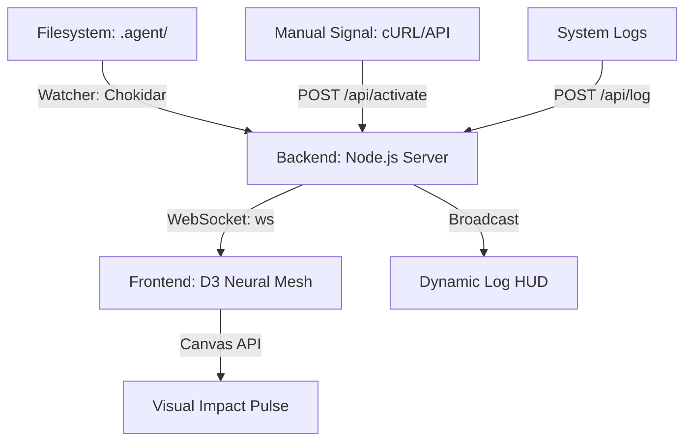

# 🌌 Antigravity Ecosystem Dashboard

> **Status**: Operational | **Design**: Brutalist / Neural Mesh | **Core**: Performance-First

O **Ecosystem Dashboard** é o centro de comando visual do Antigravity. Ele mapeia a atividade cognitiva do agente em tempo real, transformando o uso de ferramentas e workflows em uma rede neural interativa.

<video src="https://github.com/KaueBR12/Antigravity-Ecosystem/raw/main/ecosystem/teste1111.mp4" width="100%" controls></video>

---

## 🏗️ Arquitetura do Sistema

O sistema opera em uma arquitetura de malha reativa dividida em três camadas:



---

## 📟 Protocolos Operacionais

### 1. Detecção Automática (The Watcher)
O servidor monitora os seguintes diretórios para ativação automática:
- `c:/Users/kaueb/SYNC/.agent/skills/*/SKILL.md`
- `c:/Users/kaueb/SYNC/.agent/workflows/*.md`

Qualquer leitura ou modificação nestes arquivos dispara um **Activation Pulse** na categoria correspondente.

### 2. Categorização de Dados
A rede é dividida em  groupIndex (0-10) funcionais, mapeados por palavras-chave em `server.js`.
Principais categorias:
- **01 - IA & Agentes** (Ciano)
- **02 - Frontend & UI** (Rosa)
- **03 - Backend & APIs** (Verde)
- **09 - Arquitetura & Gestão** (Lima)

---

## 📡 API de Integração

O ecossistema expõe endpoints para controle manual e injeção de telemetria:

### Ativação de Skill
`POST /api/activate`
```json
{
  "skill": "brainstorm",
  "status": "working",
  "isObsidian": true
}
```

### Injeção de Log
`POST /api/log`
```json
{
  "skill": "frontend-design",
  "message": "Component refactored successfully",
  "level": "success"
}
```

---

## ⚡ Performance & Optimization

Para garantir **zero-lag** e uso mínimo de recursos:
- **Ambient Clutter Removal**: Partículas de fundo e pacotes randômicos foram desativados.
- **Intentionality**: 100% da atividade visual é baseada em eventos reais.
- **Canvas Rendering**: Processamento gráfico realizado via Canvas para suportar alta densidade de nós sem perda de frames.

---

## 🚀 Como Iniciar

1. Certifique-se de que o Antigravity está ativo.
2. No diretório `ecosystem`, execute:
   ```bash
   node server.js
   ```
3. Acesse: `http://localhost:4091`

---

> *Este documento é parte integrante do sistema Antigravity. Mantenha a estética brutalista e a integridade do código.*
